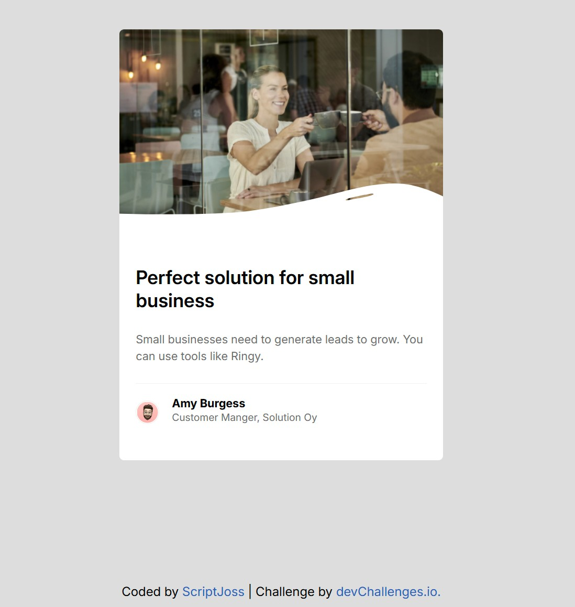

<!-- Please update value in the {}  -->

<h1 align="center">Business Blog Card by ScriptJoss | devChallenges</h1>

   Solution for a challenge <a href="https://devchallenges.io/challenge/business-blog-card" target="_blank">Business Blog Card</a> from <a href="http://devchallenges.io" target="_blank">devChallenges.io</a>.

  <h3>
    <a href="{https://your-demo-link.your-domain}">
      Demo
    </a>
     | 
    <a href="{https://your-url-to-the-solution}">
      Solution
    </a>
     | 
    <a href="https://devchallenges.io/challenge/business-blog-card">
      Challenge
    </a>
  </h3>

<!-- TABLE OF CONTENTS -->

## Table of Contents

- [Overview](#overview)
  - [What I learned](#what-i-learned)
- [Acknowledgements](#acknowledgements)
- [Built with](#built-with)
- [Features](#features)
- [Contact](#contact)

<!-- OVERVIEW -->

## Overview

Project view.

## What I learned

During the development of this project, I faced several challenges, especially finding the perfect height for the elements. However, I managed to overcome these obstacles and learn a lot in the process. I used ChatGPT not only to get answers, but as a resource to better understand how the `position` property works in CSS. I learned how to use `position` effectively, which allowed me to improve the design and functionality of the business card.

## Acknowledgements

I really enjoyed the challenge and am pleased with the final result. This project has helped me consolidate my CSS skills and apply responsive design concepts.

## Built with

- Semantic HTML5 markup
- CSS
- Flexbox

## Features

A responsive business card, with an image, descriptive text and a small image with the business owner

This application/site was created as a submission to a [DevChallenges](https://devchallenges.io/challenges-dashboard) challenge.

## Author

- GitHub [@ScriptJoss](https://{github.com/scriptjoss})
